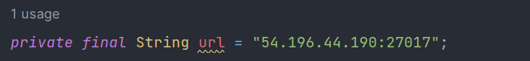

# Taller 6 AREP

## Información del programa 💾

Este proyecto está basado en una arquitectura de tipo Cliente-servidor, dessplegado en instancias de la máquina EC2 de AWS.

## Arquitectura


## Para utilizar el proyecto 👩‍💻

1. Debes clonar el proyecto haciendo uso del comando:
```
git clone https://github.com/gabriela-castro-s/AREP-TALLER-6.git
```

2. Posteriormente, debemos crear 5 instancias en AWS:


3. Nos conectamos a cada una de ellas e instalamos java con el siguiente comando, posteriormente verificamos
que la instalación haya sido exitosa:
```
//Esta linea de conección nos la da AWS
ssh -i "key.pem" ec2-user@ec2-54-242-202-222.compute-1.amazonaws.com

//Instalamos java
sudo yum install java-17-amazon-corretto-devel

//Verificamos que fue instalado
java -version
```


4. Abrimos la instancia de mongo y creamos un archivo con el siguiente comando:
```
sudo vi /etc/yum.repos.d/mongodb-org-6.0.repo
```

5. Al archivo creado le agregamos las siguientes lineas

   

```
[mongodb-org-6.0]
name=MongoDB Repository
baseurl=https://repo.mongodb.org/yum/amazon/2/mongodb-org/6.0/x86_64/
gpgcheck=1
enabled=1
gpgkey=https://www.mongodb.org/static/pgp/server-6.0.asc
```

6. Ahora instalaremos mongo de la siguiente forma:

```
sudo yum install -y mongodb-org
```


7. Para que mongo acepte que cualquier ip pueda consultarla, accedemos al siguiente archivo y editamos la dirección de la línea bindIP
0.0.0.0 como se muestra en la imagen:

```
sudo vi /etc/mongod.conf
```


8. Ejecutamos el servicio de mongo

```
sudo systemctl start mongod
```
9. Comprobamos que corra correctamente

```
sudo systemctl status mongod
```


10. Ahora debemos modificar la ip en nuestro archivo de configuracion de mongo a la ip de nuestra instancia:



11. Tambien debemos modificar las ips de RoundRobien a la de nuestras instancias de LogService


12. Ahora que cambiamos todas las configuraciones que necesitamos, vamos a generar la carpeta target con el comando 
```
mvn clean install
```
13. Una vez generada la carpeta, vamos a comprimirla en un archivo .zip. Posteriormente nos conectaremos a todas nuestras instancias,
exceptuando la de mongo, para copiar este archivo con el siguiente comando:

```
//Recuerde que este comando cambia dependiendo de la instancia a la que desea conectarse
sftp -i "key.pem" ec2-user@ec2-54-242-202-222.compute-1.amazonaws.com
```


14. Una vez hayamos copiado el archivo target.zip a todas nuestras instancias, lo descomprimimos de la siguiente forma:

```
unzip target.zip
```

15. Ahora solo nos queda correr nuestras instancias con el siguiente comando:
```
//En las instancias LogService
java -cp "target/classes:target/dependency/*" edu.eci.arep.LogServiceApp

//En la instancia RoundRobin
java -cp "target/classes:target/dependency/*" edu.eci.arep.RoundRobin
```
16. Ahora podemos abrir nuestro programa por medio del siguiente link generado por la instancia RoundRobin, agregandole el
puerto al que deseamos acceder, en este caso 4566. **Es importante que edite los grupos de seguridad para que las instancias puedan acceder
a estos puertos**
```
http://ec2-44-200-119-136.compute-1.amazonaws.com:4566/

```
17. Listo! Puede utilizar la aplicación


## Requisitos 📋
- Java: Ambiente de desarrollo
- Maven: Administrador del ciclo de vida del Proyecto
- Git: Controlador de versiones
- AWS: Para la creación de las instancias

## Construido con 🛠️

IntelliJ IDEA 2022.3.2 (Community Edition)

## Autores ✒️

* **Gabriela Castro Santamaría** [gabriela-castro-s](https://github.com/gabriela-castro-s) 